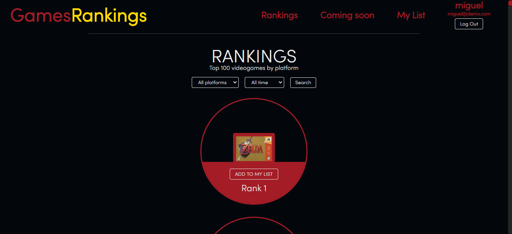

# Proyecto final del Master

## Vieogame Rankings - Front-end, Back-end, SSR, Node.js, Express, MongoDB, JWT Auth, Pug, Heroku

Aplicación para obtener el top 100 de videojuegos de las distintas plataformas, enterarse de próximos lanzamientos y guardarlos en tu lista de preferncias. 🙂

## Deploy en Heroku 🚀 [LINK](https://morning-bastion-27317.herokuapp.com/) 🚀

## Requisitos

**Imprescindibles para este proyecto:**
- Web Backend (Rutas Backend, Nodejs y/o Cloud functions)
- Web Frontend (Ajax, HTML5 Apis, rutas front, etc...)
- Scraping
- Uso de patrones
- Test de elementos críticos
- Deploy real en cloud (heroku)
- Entorno Dev y Entorno Producción
- Gestión del proyecto desde el inicio en un repositorio propio en Github
- Base de datos (Mongo, MySQL o CloudFire)

**No críticos pero puntuables para este proyecto:**
- Websockets
- Integración con servicios en cloud
- Version CLI
- Gestion de ficheros en Firebase/Amazon S3

**Extras:**
- Test E2E y demás
- JSDocs
